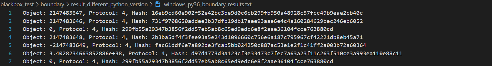
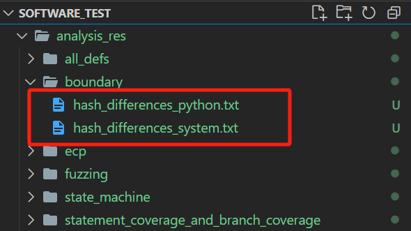
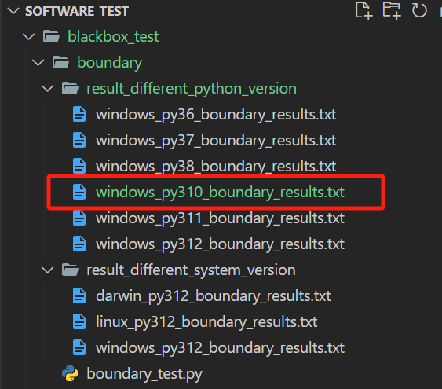

# BTH-014 Software Testing Project

<div align="center">

[简体中文](./README_CN.md) | **English**

</div>

## Project Introduction

This project tests the stability of the `pickle` module's serialization functionality in the Python standard library. The goal is to study how different test environments affect the hash value of the `dump/ dumps` output for the same input. The environments are divided into two categories:

1. **Different operating systems** under **Python 3.12** ( **Windows** ,  **Linux** , and  **macOS** )
2. **Different Python versions** under **Windows** (Python  **3.6** ,  **3.7** ,  **3.8** ,  **3.11** ,  **3.12** )

For different systems, we **migrate the code** and compare the merged test results.

For different Python versions, we use **conda** for dynamic environment management.

## Project Structure

```
Software_test
├── blackbox_test
│   ├── boundary # Boundary testing
│   │   ├── result_different_python_vision # Results for different Python versions
│   │   ├── result_different_system_vision # Results for different systems
│   │   └── boundary_test.py # Generates test data, runs tests, and logs results
│   ├── ecp # Equivalence Class Partitioning
│   │   ├── result_different_python_version
│   │   ├── result_different_system_version
│   │   └── ecp_test.py
│   ├── fuzzing # Fuzzing testing
│   │   ├── result_different_python_version
│   │   ├── result_different_system_version
│   │   └── fuzzing_test.py
│   └── state_machine # State Machine
│       ├── result_different_python_version
│       ├── result_different_system_version
│       └── state_machine_test.py
├── whitebox_test
│   ├── all_defs # All-defs coverage
│   │   ├── result_different_python_version
│   │   ├── result_different_system_version
│   │   └── all_defs_test.py
│   └── statement_coverage_and_branch_coverage 
│       ├── result_different_python_version
│       ├── result_different_system_version
│       ├── coverage_test.py
│       └── my_pickle.py # A copy of the pickle module for coverage analysis
├── tools # Utility tools
│       ├── analysis.py # Compares hash values of test results
│       └── clean_redundant_files.py # Cleans up redundant test files
├── analysis_res # Stores analysis results
├── Windows_test.bat # One-click test execution on Windows
├── Windows_analysis.bat # One-click hash analysis on Windows
├── Linux_macOS_test.sh # One-click test execution on Linux/macOS
└── Linux_macOS_analysis.sh # One-click hash analysis on Linux/macOS
```

## Running the Project

### Quick Start

All tests have been executed under various systems ( **Windows** ,  **Linux** , and  **macOS** ) and Python versions ( **3.6** ,  **3.7** ,  **3.8** ,  **3.11** ,  **3.12** ). The results are saved in:

* `result_different_python_version`
* `result_different_system_version`

For example, boundary test results under Windows and Python 3.6 are shown below:



Each row consists of three parts:  **Object** ,  **Protocol** , and  **Hash** , which correspond to the  **input** ,  **pickle protocol version** , and the **hash value** of the serialized output.

To run the analysis script from the project root (on Windows):

```
./Windows_analysis.bat
```

Or (on Linux/macOS):

```
chmod +x Linux_macOS_analysis.sh
./Linux_macOS_analysis.sh
```

After comparing hash values line by line, any discrepancies will be stored in the `analysis_res` folder in the root directory, as shown below:



### Run the Test

If you want to run the test codes on your own OS and Python version to generate additional comparison files:

On Windows:

```
./Windows_test.bat
```

Or (on Linux/macOS):

```
chmod +x Linux_macOS_test.sh
./Linux_macOS_test.sh
```

All test codes will be executed. (**fuzzing_test.py** generates **100,000 test cases** and takes around **30 seconds** to run)

Test results are named as `SystemName_PythonVersion_TestName_result.txt` and saved in:

* `result_different_python_version`
* `result_different_system_version`

For example, when running the boundary test under Windows with Python 3.10, the results are saved in `result_different_python_version`, as shown:



To compare results, refer to the **Quick Start** section above.

### View Statement/Branch Coverage

Run the following in the project root:

```
coverage run --branch -m pytest whitebox_test\statement_coverage_and_branch_coverage\coverage_test.py -v
coverage report -m
```
