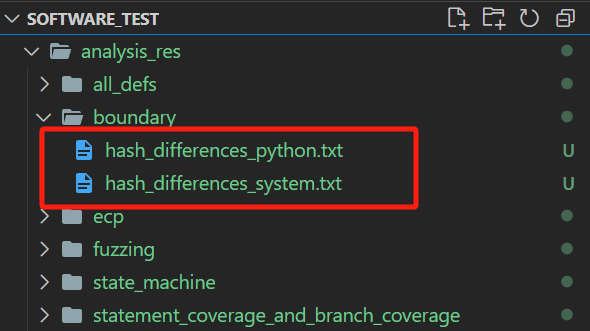
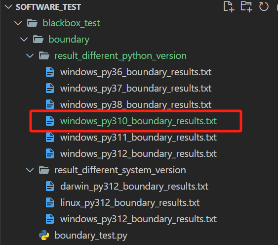

# BTH-014 软件测试项目

<div align="center">

**简体中文** | [English](./README_EN.md)

</div>

## 项目介绍

本项目对python标准库中 `pickle`模块序列化功能的稳定性进行了测试，意在研究对于相同的输入，哪些测试环境的影响会使输出结果的哈希值发生改变。测试环境可分为以下两组：

1. **Python3.12下**的**不同系统**（**Windows**、**Linux**和**macOS**）
2. **Windows**系统下的**不同Python版本**（**3.6**、**3.7**、**3.8**、**3.11**、**3.12**）

对于不同系统，我们选择**迁移代码**进行测试，将测试结果合并后进行比较。

对于不同Python版本，我们使用**conda**进行动态管理。

## 项目结构

```
Software_test
├── blackbox_test
│   ├── boundary # 边界测试
│   │   ├── result_different_python_vision # 记录边界测试不同python版本的测试结果
│   │   ├── result_different_system_vision # 记录边界测试不同系统的测试结果
│   │   └── boundary_test.py # 生成测试数据，进行测试并记录
│   ├── ecp # 等价类划分
│   │   ├── result_different_python_version
│   │   ├── result_different_system_version
│   │   └── ecp_test.py
│   ├── fuzzing # 模糊测试
│   │   ├── result_different_python_version
│   │   ├── result_different_system_version
│   │   └── fuzzing_test.py
│   └── state_machine # 状态机
│       ├── result_different_python_version 
│       ├── result_different_system_version 
│	└── state_machine_test.py
├── whitebox_test
│   ├── all_defs # 定义覆盖
│   │   ├── result_different_python_version 
│   │   ├── result_different_system_version
│   │   └── all_defs_test.py
│   │   
│   └── statement_coverage_and_branch_coverage # 语句覆盖和分支覆盖
│       ├── result_different_python_version
│       ├── result_different_system_version
│	├── coverage_test.py
│	└── my_pickle.py # 将pickle模块复制到目录下，便于计算覆盖率
├── tools # 测试使用的其他工具
│       ├── analysis.py # 用于比较测试结果哈希值的函数
│       └── clean_redundant_files.py # 用于清理测试产生的多余文件
├── analysis_res # 存储分析结果
├── Windows_test.bat # Windows下一键执行测试
├── Windows_analysis.bat # Windows下一键执行测试结果哈希值比较分析
├── Linux_macOS_test.sh # Linux下一键执行测试
└── Linux_macOS_analysis.sh # Linux下一键执行测试结果哈希值比较分析
```

# 运行项目

## 快速开始

我们已经在不同的系统（**Windows**、**Linux**和**macOS**）和不同的python版本（**3.6**、**3.7**、**3.8**、**3.11**、**3.12**）下运行过所有测试，测试结果存储在对应测试目录下的：

* `result_different_python_version`
* `result_different_system_version`

以边界测试在Windows，Python3.6下的测试结果为例，如图所示：


每一行分为三部分：**Object**，**Protocol**和**Hash**，分别对应**输入**，**pickle协议版本**和**输入序列化后的哈希值**

请进入项目根目录，运行以下命令（Windows系统下）：

```
./Windows_analysis.bat
```

或（Linux/macOS系统下）：

```
chmod +x Linux_macOS_analysis.sh
./Linux_macOS_analysis.sh
```

所有测试结果逐行比较哈希值后，哈希值不同的行将存储到根目录的 `analysis_res` 文件夹中，如图所示：



## 执行测试代码

若您想在自己的操作系统和Python版本下运行测试代码，获取更多用于比较的文件，

在项目根目录运行（Windows系统下）：

```
./Windows_test.bat
```

或（Linux/macOS系统下）：

```
chmod +x Linux_macOS_test.sh
./Linux_macOS_test.sh
```

所有测试代码都将被执行（**fuzzing.py**生成了**10万组**数据，运行时间需要约**30秒**）

测试运行结果以 `系统名称_python版本_测试名称_result.txt` 命名，以测试文件中 `save_test_result`函数的逻辑分配到：

* `result_different_python_version`
* `result_different_system_version`

以边界测试为例，我在Windows，Python3.10的环境下执行测试代码，测试结果被分配到 `result_different_python_version` 文件夹，如图所示：



要对结果进行比较，请见第一节**快速开始**

## 查看语句/分支覆盖测试代码的覆盖率

在项目根目录下运行：

```
coverage run --branch -m pytest whitebox_test\statement_coverage_and_branch_coverage\coverage_test.py -v 
coverage report -m
```
